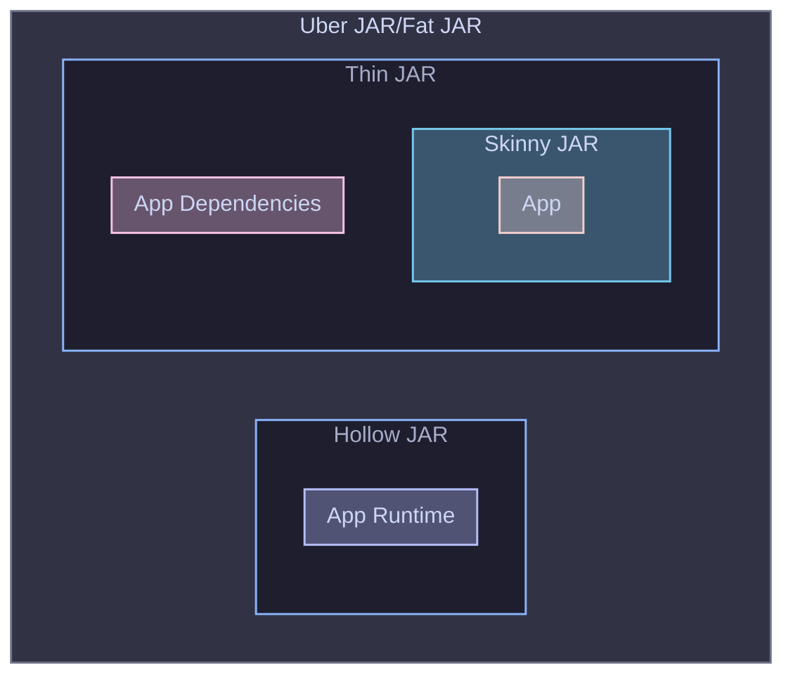

# Third-party builds of the HiveServer2 JDBC Driver

<p>
    <a>
        
    </a>
    <a>
        
    </a>
</p>

The purpose of the current project is to create a `Thin JAR` of HiveServer2 JDBC Driver.



The steps to use directly in Maven are as follows.
The latest version is available
at https://central.sonatype.com/artifact/io.github.linghengqian/hive-server2-jdbc-driver-thin .

```xml

<dependencies>
    <dependency>
        <groupId>io.github.linghengqian</groupId>
        <artifactId>hive-server2-jdbc-driver-thin</artifactId>
        <version>{latest.version}</version>
    </dependency>
</dependencies>
```

The current project also provides a HiveServer2 JDBC Driver Uber JAR to simplify the steps of specifying the `classifier`.
The steps to use directly in Maven are as follows.
The latest version is at https://central.sonatype.com/artifact/io.github.linghengqian/hive-server2-jdbc-driver-uber .

```xml
<dependencies>
    <dependency>
        <groupId>io.github.linghengqian</groupId>
        <artifactId>hive-server2-jdbc-driver-uber</artifactId>
        <version>{latest.version}</version>
    </dependency>
</dependencies>
```

## Subprojects

- [tinycircus](subprojects/tinycircus/README.md), for distributing unit-test-friendly Linux Containers.

## Document

Refer to [QuickStart](subprojects/doc/QuickStart.md).

## Compatibility

### For HiveServer2 `4.0.x`

All release products have been verified and usable in the GraalVM Native Image compiled by `GraalVM CE For JDK 22.0.2` and `GraalVM CE For JDK 24.0.2`.

For HotSpot VM, all JAR products can be run on any `OpenJDK 8` and later distribution.

For the Docker Image of `apache/hive:4.0.0`, 
you can use `1.4.0` of `io.github.linghengqian:hive-server2-jdbc-driver-thin` or `io.github.linghengqian:hive-server2-jdbc-driver-uber`.

For the Docker Image of `apache/hive:4.0.1`, 
you can use `1.8.2` of `io.github.linghengqian:hive-server2-jdbc-driver-thin` or `io.github.linghengqian:hive-server2-jdbc-driver-uber`.

### For HiveServer2 `4.1.x`

All release products have been verified and usable in the GraalVM Native Image compiled by `GraalVM CE For JDK 22.0.2` and `GraalVM CE For JDK 24.0.2`.

For HotSpot VM, all JAR products can be run on any `OpenJDK 17` and later distribution.

For the Docker Image of `apache/hive:4.1.0`,
you can use `2.0.0-SNAPSHOT` of `io.github.linghengqian:hive-server2-jdbc-driver-thin` or `io.github.linghengqian:hive-server2-jdbc-driver-uber`.
**This sub-task has not yet been completed.**

## FAQ

Refer to [FAQ](subprojects/doc/FAQ.md).

## Background

Refer to [Background](subprojects/doc/Background.md).

## Release Note

Refer to [CHANGELOG](subprojects/doc/CHANGELOG.md).

## Contributing

Refer to [CONTRIBUTING](subprojects/doc/CONTRIBUTING.md).

## License

Refer to [LICENSE](./LICENSE) and [NOTICE](./NOTICE).

The license applies to both the source code and the final JAR distributed on Maven Central.
