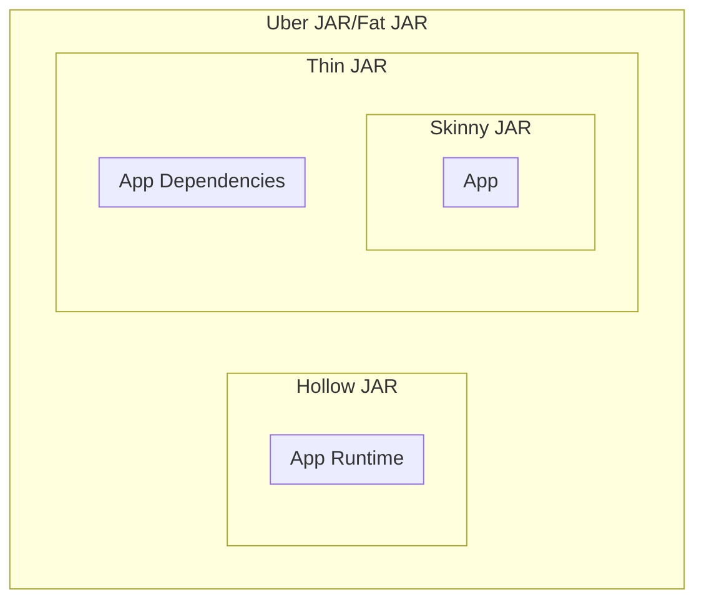

# Third-party builds of the HiveServer2 JDBC Driver

<p>
    <a>
        
    </a>
    <a>
        
    </a>
</p>

The purpose of the current project is to create a `Thin JAR` of HiveServer2 JDBC Driver.



The steps to use directly in Maven are as follows.
The latest version is at [Maven Central](https://central.sonatype.com/artifact/io.github.linghengqian/hive-server2-jdbc-driver-uber).

```xml
<dependencies>
    <dependency>
        <groupId>io.github.linghengqian</groupId>
        <artifactId>hive-server2-jdbc-driver-uber</artifactId>
        <version>{latest.version}</version>
    </dependency>
</dependencies>
```

## Quick Links

- **[Quick Start](quick-start)** - Get started quickly with examples
- **[Background](background)** - Learn about the project's purpose and motivation
- **[FAQ](faq)** - Frequently asked questions and troubleshooting
- **[Contributing](contributing)** - How to contribute to the project
- **[Changelog](changelog)** - Release notes and version history

## Subprojects

- [tinycircus](https://github.com/linghengqian/hive-server2-jdbc-driver/tree/master/subprojects/tinycircus) - for distributing unit-test-friendly Linux Containers.

## Compatibility

### For HiveServer2 `4.0.x`

Use `1.x` series.

### For HiveServer2 `4.1.x`

Use `2.x` series.